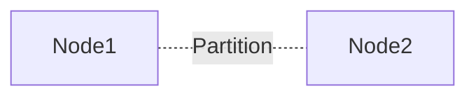
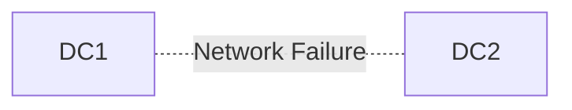

# CAP Theorem

CAP theorem states that a distributed system can only fully guarantee two of the following three properties during a network partition:

* Consistency
* Availability
* Partition Tolerance

---

# The Three Components

## Consistency (C)

Every read receives the latest write.

All nodes see the same data at the same time.

Example:

```txt id="50o7qd"
User updates profile
All future reads return updated value
```

---

## Availability (A)

Every request receives a response.

System continues operating even during failures.

Response may not always contain latest data.

---

## Partition Tolerance (P)

System continues functioning despite network failures between nodes.

Example:

```txt id="1smik6"
Datacenter A cannot communicate with Datacenter B
```

Distributed systems must generally tolerate partitions.

---

# Why CAP Exists

In distributed systems, network failures are unavoidable.

When a partition occurs:

* nodes cannot communicate reliably
* system must choose between:

  * consistency
  * availability

Cannot fully guarantee both simultaneously.

---

# CP Systems

Choose:

* Consistency
* Partition Tolerance

Sacrifice:

* Availability during partitions



If communication breaks:

* some requests may be rejected
* system prioritizes correctness

---

## Examples

* HBase
* MongoDB (configured strongly consistent)
* Zookeeper
* etcd

---

## Tradeoff

Better correctness but reduced availability during failures.

Used when:

* correctness is critical
* stale data unacceptable

Example:

* banking systems
* distributed locks

---

# AP Systems

Choose:

* Availability
* Partition Tolerance

Sacrifice:

* Strong consistency

System always responds even if data is stale.

---

## Examples

* Cassandra
* DynamoDB
* Riak

---

## Tradeoff

Better uptime and scalability but eventual consistency.

Used when:

* high availability is more important
* temporary inconsistency acceptable

Example:

* social feeds
* likes/views counters
* analytics systems

---

# CA Systems

Choose:

* Consistency
* Availability

Not partition tolerant.

Rare in distributed systems because network partitions are inevitable.

Typically:

* single-node databases
* tightly coupled systems

---

# Eventual Consistency

Common in AP systems.

Data may temporarily differ across nodes but eventually converges.

Example:

```txt id="9q4u7u"
User updates profile photo
Some servers show old image briefly
```

---

# CAP During Normal Operation

CAP mainly matters during partitions.

Without network failures:

* systems may provide both consistency and availability

Tradeoffs appear during communication failures.

---

# Common Misunderstanding

CAP does NOT mean:

```txt id="yajh74"
Pick any 2 permanently
```

It means:

```txt id="u4w6e7"
During a partition, choose consistency or availability
```

Partition tolerance is generally mandatory in distributed systems.

---

# Real-World Tradeoffs

| System            | Preference | Reason                   |
| ----------------- | ---------- | ------------------------ |
| Banking           | CP         | Strong correctness       |
| Social media feed | AP         | High uptime              |
| DNS               | AP         | Availability prioritized |
| Distributed locks | CP         | Consistency critical     |

---

# Failure Scenario Example

## Network Partition



Two datacenters lose communication.

System choices:

* reject writes to preserve consistency
* allow writes and reconcile later

---

# Important Tradeoffs

| Choice               | Advantage          | Disadvantage            |
| -------------------- | ------------------ | ----------------------- |
| Strong consistency   | Correct data       | Lower availability      |
| High availability    | Better uptime      | Possible stale reads    |
| Eventual consistency | Better scalability | Temporary inconsistency |

---

# Interview Discussion Points

* Why partition tolerance is unavoidable
* Eventual consistency
* Quorum reads/writes
* Replica synchronization
* Read-after-write consistency
* Strong vs eventual consistency
* CAP vs PACELC theorem
