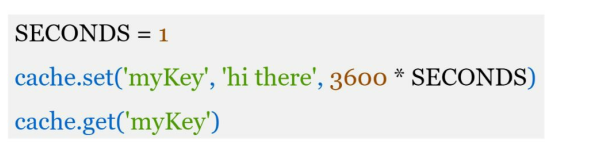
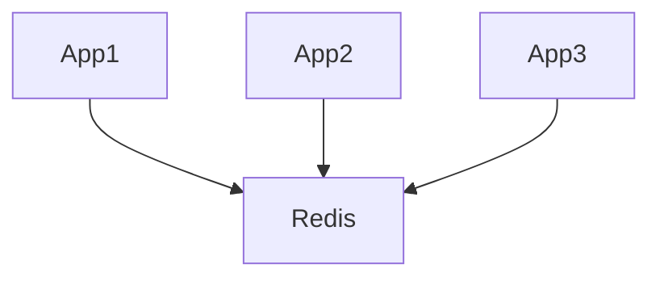

# Caching

Caching reduces latency and database load by storing frequently accessed data in faster storage.

Example of a typical memcached API


---

# Cache Aside (Lazy Loading)

Most common caching strategy.

```txt
1. Read from cache
2. Cache miss -> fetch DB
3. Store in cache
4. Return response
```

### Pros

* Simple
* Cache only stores hot data

### Cons

* Initial cache miss latency
* Stale data possible

---

# Write Through vs Write Back

| Strategy      | Description                    | Tradeoff                          |
| ------------- | ------------------------------ | --------------------------------- |
| Write Through | Write to cache + DB together   | Better consistency, slower writes |
| Write Back    | Write to cache first, DB later | Faster writes, risk of data loss  |

---

# Eviction Policies

| Policy | Best For               | Weakness                           |
| ------ | ---------------------- | ---------------------------------- |
| LRU    | General workloads      | Poor for frequency-heavy access    |
| LFU    | Stable access patterns | Slow adaptation to traffic changes |
| TTL    | Simple expiration      | Can cause synchronized expirations |

---

# Cache Stampede

Large number of requests simultaneously miss cache and hit DB.

### Problems

* DB overload
* latency spikes

### Mitigation

* request coalescing
* distributed locks
* staggered TTLs
* stale-while-revalidate

---

# Hot Keys

A small number of keys receive massive traffic.

Example:

* trending post
* viral video

### Problems

* single-node overload
* uneven traffic distribution

### Mitigation

* replication
* local in-process cache
* sharding

---

# Distributed Cache

Shared cache across multiple servers.



### Challenges

* consistency
* network latency
* cache invalidation

---

# Cache Invalidation

Keeping cache synchronized with database updates.

### Common Problems

* stale reads
* race conditions
* delayed invalidation

### Approaches

* TTL-based expiration
* write-through updates
* event-driven invalidation

---

# Redis vs Memcached

| Redis                     | Memcached        |
| ------------------------- | ---------------- |
| Rich data structures      | Simple key-value |
| Persistence support       | In-memory only   |
| Replication support       | Lightweight      |
| More operational features | Simpler setup    |

---

# Failure Scenarios

| Failure           | Impact            | Mitigation         |
| ----------------- | ----------------- | ------------------ |
| Cache crash       | DB traffic spike  | Replication        |
| Network partition | Increased latency | Fallback logic     |
| Hot partition     | Uneven load       | Consistent hashing |

---

# Important Tradeoffs

| Choice            | Advantage        | Disadvantage           |
| ----------------- | ---------------- | ---------------------- |
| Large TTL         | Lower DB load    | Staler data            |
| Small TTL         | Fresher data     | Higher DB traffic      |
| Distributed cache | Scalability      | Operational complexity |
| Local cache       | Very low latency | Inconsistent state     |

---

# Interview Discussion Points

* Why cache invalidation is difficult
* Handling hot partitions
* Preventing cache stampede
* Choosing TTL values
* Redis persistence tradeoffs
* Cache consistency models
* Multi-region cache design
