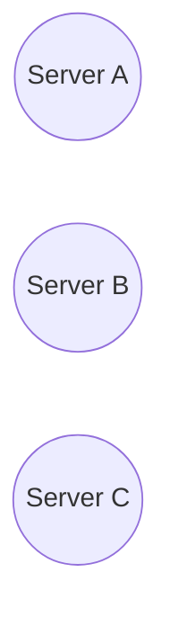

# Consistent Hashing

Consistent hashing distributes data across multiple servers while minimizing data movement during scaling events.

Used heavily in:

* distributed caches
* sharded databases
* CDNs
* distributed storage systems

---

# Problem with Normal Hashing

Traditional hashing:

```txt id="6dyk24"
server = hash(key) % N
```

Where:

* key = data key
* N = number of servers

---

# Scaling Problem

If number of servers changes:

* almost all keys remap
* massive data movement occurs

Example:

```txt id="3m7w2v"
hash(key) % 3
```

Adding one server:

```txt id="5wt6dt"
hash(key) % 4
```

Most mappings change.

---

# Core Idea

Map:

* servers
* keys

onto a circular hash ring.



Keys are assigned clockwise to nearest server.

---

# Key Assignment

```txt id="scm69h"
1. Hash the key
2. Move clockwise on ring
3. First server encountered owns key
```

---

# Why It Helps

When a server is added/removed:

* only nearby keys remap
* majority of keys stay unchanged

This minimizes:

* cache invalidation
* data migration
* network traffic

---

# Adding a Server


Only keys between:

* previous node
* new node

are redistributed.

---

# Removing a Server

If a server fails:

* its keys move to next server clockwise

Minimal redistribution occurs.

---

# Virtual Nodes (VNodes)

Real systems use multiple virtual nodes per server.

Instead of:

```txt id="1g30m8"
1 server = 1 position
```

Use:

```txt id="nqq1gb"
1 server = many positions
```

---

# Why Virtual Nodes Matter

Without vnodes:

* uneven distribution possible

With vnodes:

* better load balancing
* smoother distribution
* reduced hotspots

---

# Example


Server A owns:

* A1
* A2

Multiple positions improve balance.

---

# Common Problems

## Hot Keys

Some keys receive massive traffic.

Example:

* viral video
* celebrity profile

### Problems

* overloaded node
* uneven traffic

### Mitigation

* replication
* local caching
* request spreading

---

# Uneven Distribution

Poor hash functions can cluster keys unevenly.

### Mitigation

* better hashing algorithms
* virtual nodes

---

# Rebalancing Cost

Even consistent hashing still requires some data migration.

### Tradeoff

* much smaller than traditional hashing
* but not zero-cost

---

# Real-World Usage

| System        | Usage               |
| ------------- | ------------------- |
| Cassandra     | Data partitioning   |
| DynamoDB      | Distributed storage |
| Redis Cluster | Key distribution    |
| CDN routing   | Edge assignment     |

---

# Tradeoffs

| Choice              | Advantage              | Disadvantage             |
| ------------------- | ---------------------- | ------------------------ |
| Traditional hashing | Simple                 | Massive remapping        |
| Consistent hashing  | Minimal redistribution | More complex             |
| Virtual nodes       | Better balance         | Higher metadata overhead |

---

# Failure Scenarios

| Failure        | Impact           | Mitigation            |
| -------------- | ---------------- | --------------------- |
| Node crash     | Key reassignment | Replication           |
| Hot partition  | Uneven load      | VNodes                |
| Uneven hashing | Poor balance     | Better hash functions |

---

# Interview Discussion Points

* Why modulo hashing fails at scale
* Virtual nodes
* Rebalancing
* Hot partitions
* Replication strategies
* Consistent hashing in caches
* Data migration during scaling
