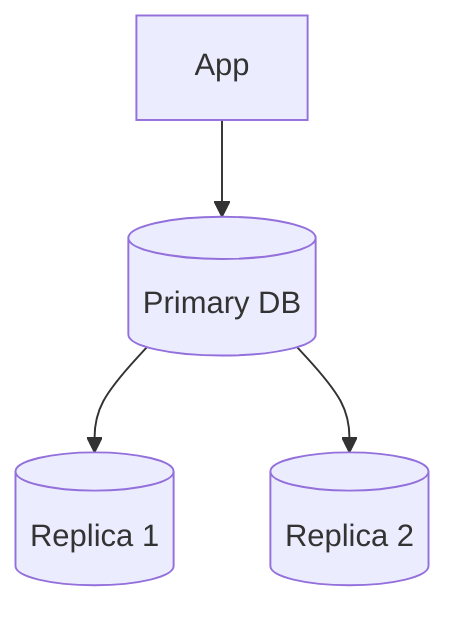
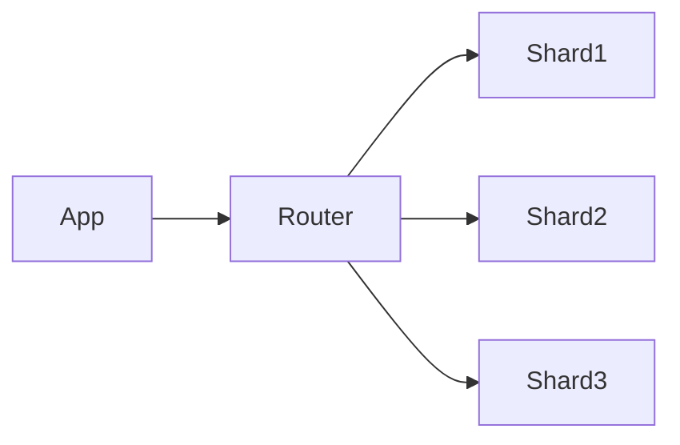

# Database Scaling

Database scaling is the process of increasing a system’s ability to handle:

* higher traffic
* larger datasets
* increased concurrency

---

# Vertical vs Horizontal Scaling

| Type               | Description                          | Limitation        |
| ------------------ | ------------------------------------ | ----------------- |
| Vertical Scaling   | Increase CPU/RAM of single DB server | Hardware limit    |
| Horizontal Scaling | Add more DB servers                  | Higher complexity |

Vertical scaling is simple initially but does not scale indefinitely.

---

# Read Replication

Use replicas to distribute read traffic.

### Benefits

* Higher read throughput
* Reduced primary load

### Problems

* Replication lag
* Eventual consistency

### Interview Discussion

* Read-after-write consistency
* Replica lag handling
* Failover strategy

---

# Database Sharding

Split data across multiple databases.

Each shard stores only part of dataset.

---

# Sharding Strategies

| Strategy    | Description               | Problem                 |
| ----------- | ------------------------- | ----------------------- |
| Range-based | Split by ID ranges        | Hot shards              |
| Hash-based  | Hash key determines shard | Hard range queries      |
| Geo-based   | Split by region           | Cross-region complexity |

---

# Consistent Hashing

Used to reduce data movement when adding/removing shards.

### Benefit

* Minimal reshuffling during scaling

### Common Usage

* distributed caches
* sharded databases

---

# Partition Hotspots

Uneven traffic causes some shards to overload.

Example:

* celebrity users
* trending content

### Mitigation

* better shard keys
* load-aware partitioning
* replication

---

# Indexing

Indexes speed up reads but increase write cost.

### Tradeoff

* faster queries
* slower inserts/updates
* more storage usage

### Interview Discussion

* B-Tree vs Hash indexes
* composite indexes
* over-indexing problems

---

# Denormalization

Duplicate data to reduce joins.

### Advantages

* faster reads
* simpler queries

### Disadvantages

* data inconsistency risk
* harder updates

Common in:

* high-scale systems
* NoSQL databases

---

# SQL vs NoSQL

| SQL                | NoSQL                     |
| ------------------ | ------------------------- |
| Strong consistency | Easier horizontal scaling |
| Relational data    | Flexible schema           |
| ACID support       | High write throughput     |

---

# CAP Theorem

Distributed systems can only fully guarantee two of:

* Consistency
* Availability
* Partition Tolerance

Partition tolerance is usually mandatory in distributed systems.

---

# Replication Lag

Replicas may not immediately reflect latest writes.

### Problems

* stale reads
* inconsistent user experience

### Mitigation

* read from primary after writes
* quorum reads
* bounded staleness

---

# Multi-Leader Replication

Multiple writable database nodes.

### Advantages

* lower regional latency
* better availability

### Problems

* conflict resolution
* write conflicts

---

# Database Failover

If primary DB crashes:

* replica promoted to primary

### Challenges

* failover delay
* stale replicas
* split-brain scenarios

---

# Connection Pooling

Applications reuse DB connections instead of opening new ones repeatedly.

### Benefits

* lower overhead
* better throughput

### Problems

* pool exhaustion
* connection leaks

---

# Common Bottlenecks

| Problem               | Mitigation         |
| --------------------- | ------------------ |
| Read overload         | Replicas + caching |
| Write bottleneck      | Sharding           |
| Large joins           | Denormalization    |
| Hot partitions        | Better shard keys  |
| Connection exhaustion | Pooling            |

---

# Failure Scenarios

| Failure           | Impact        | Mitigation          |
| ----------------- | ------------- | ------------------- |
| Primary DB crash  | Downtime      | Automatic failover  |
| Replica lag       | Stale reads   | Read routing        |
| Hot shard         | High latency  | Rebalancing         |
| Network partition | Inconsistency | Consensus protocols |

---

# Important Tradeoffs

| Choice      | Advantage            | Disadvantage              |
| ----------- | -------------------- | ------------------------- |
| Replication | Better read scaling  | Lag issues                |
| Sharding    | Better write scaling | Operational complexity    |
| SQL         | Strong consistency   | Harder horizontal scaling |
| NoSQL       | Scalability          | Weaker consistency        |

---

# Interview Discussion Points

* Choosing shard keys
* Handling replica lag
* SQL vs NoSQL decisions
* Multi-region databases
* Rebalancing shards
* Preventing hot partitions
* Read/write separation
* Consistency vs availability
