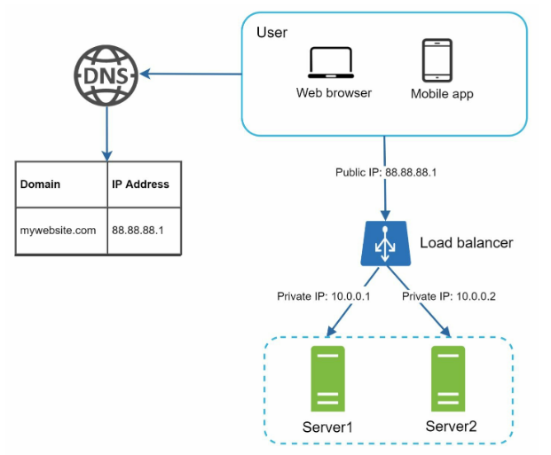
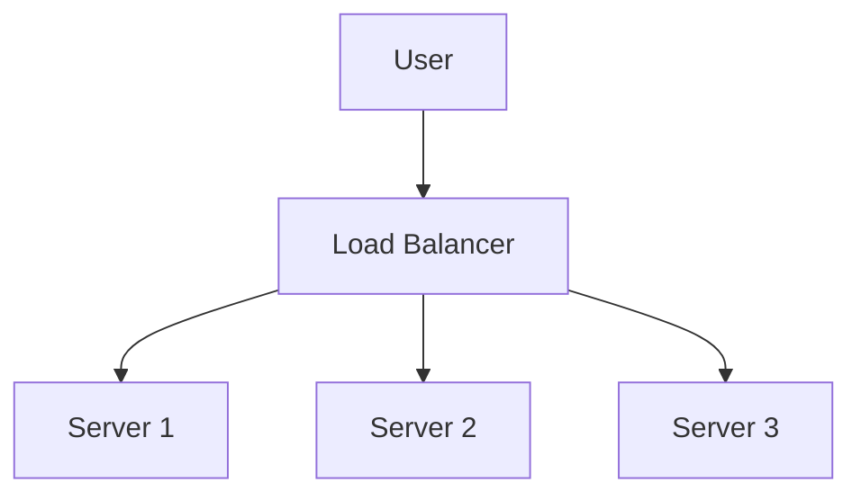
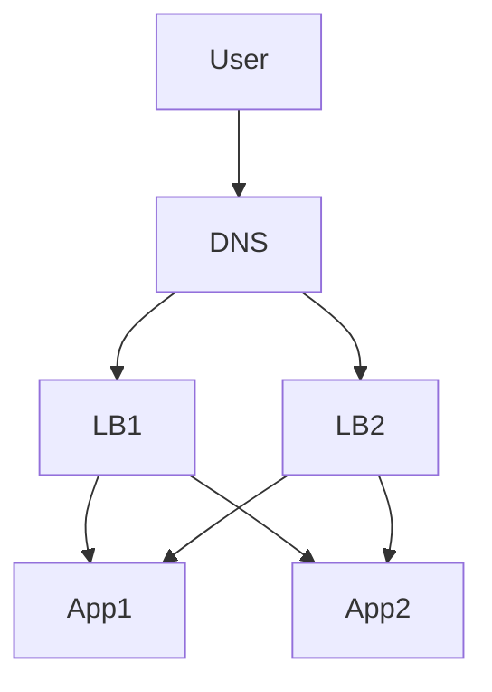

# Load Balancing

## What Is a Load Balancer?

A load balancer is a system that distributes incoming network traffic across multiple servers to improve:
- availability
- scalability
- fault tolerance
- latency

Without a load balancer, a single server becomes a bottleneck and single point of failure.

---

# Why Load Balancers Exist

- Prevent server overload
- Improve response times
- Increase system reliability
- Enable horizontal scaling
- Handle traffic spikes gracefully

---

# Basic Architecture





---

# Types of Load Balancers

## Layer 4 Load Balancer

Operates at the transport layer (TCP/UDP).

Routes traffic using:
- IP address
- Port

Examples:
- LVS
- AWS NLB

### Advantages
- Very fast
- Lower latency
- Less processing overhead

### Disadvantages
- Cannot inspect HTTP content
- Limited routing logic

---

## Layer 7 Load Balancer

Operates at the application layer (HTTP/HTTPS).

Routes traffic using:
- URL paths
- Headers
- Cookies
- Hostnames

Examples:
- NGINX
- HAProxy
- Envoy
- AWS ALB

### Advantages
- Smart routing
- SSL termination
- Authentication support
- Better observability

### Disadvantages
- More CPU overhead
- Higher latency than L4

---

# Load Balancing Algorithms

## Round Robin

Requests are distributed sequentially.

```txt
Req1 -> S1
Req2 -> S2
Req3 -> S3
Req4 -> S1
```

### Pros
- Simple
- Easy to implement

### Cons
- Ignores server load
- Bad when servers have unequal capacity

---

## Weighted Round Robin

Servers receive traffic proportional to assigned weights.

```txt
S1 weight = 5
S2 weight = 2
```

S1 receives more traffic.

### Use Case
Different server capacities.

---

## Least Connections

Traffic goes to the server with the fewest active connections.

### Pros
- Better for long-lived connections

### Cons
- Requires tracking active sessions

---

## IP Hashing

Client IP is hashed to always route to the same server 

### Advantages
- Session persistence
- Sticky sessions

### Disadvantages
- Uneven distribution possible

---

## Consistent Hashing

Maps requests and servers onto a hash ring.

Used heavily in:
- CDNs
- distributed caches
- sharded databases

### Benefits
- Minimal remapping during scaling
- Better distribution stability

---

# Health Checks

Load balancers continuously verify server health.

If a server fails:
- traffic is removed from it
- requests are redirected elsewhere

Health checks may be:
- TCP checks
- HTTP checks
- custom application checks

---

# SSL Termination

Load balancer handles HTTPS encryption/decryption.


### Advantages
- Offloads CPU work from application servers
- Simplifies certificate management

### Risks
- Internal traffic becomes unencrypted unless re-encrypted

---

# Session Persistence (Sticky Sessions)

Requests from the same user are routed to the same backend.

Methods:
- Cookies
- IP hashing

### Problems
- Uneven traffic distribution
- Harder autoscaling
- Poor fault tolerance

Modern systems usually prefer:
- stateless services
- centralized session stores

---

# Reverse Proxy vs Load Balancer

| Reverse Proxy | Load Balancer |
|---|---|
| Protects backend servers | Distributes traffic |
| Can cache responses | Balances requests |
| Often Layer 7 | Layer 4 or Layer 7 |

Many systems combine both roles.

Example:
- NGINX
- Envoy

---

# Common Bottlenecks

| Problem | Solution |
|---|---|
| Single LB failure | Multiple LBs |
| Uneven traffic | Better algorithms |
| SSL overhead | Hardware acceleration |
| Sticky sessions | Stateless services |
| Sudden traffic spikes | Autoscaling |

---

# High Availability Setup



---

# Load Balancer Failures

## Load Balancer Crash

### Impact
Entire service becomes unreachable.

### Mitigation
- Active-passive failover
- Multiple load balancers
- Health-based DNS routing

---

## Backend Overload

### Symptoms
- increased latency
- request drops
- timeout errors

### Mitigation
- autoscaling
- rate limiting
- queue buffering

---


# Key Takeaways

- Load balancers improve scalability and reliability.
- Layer 4 focuses on speed.
- Layer 7 enables intelligent routing.
- Health checks are critical for fault tolerance.
- Stateless architectures scale better.
- Modern distributed systems heavily rely on load balancing at multiple layers.