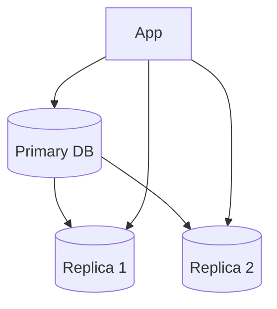
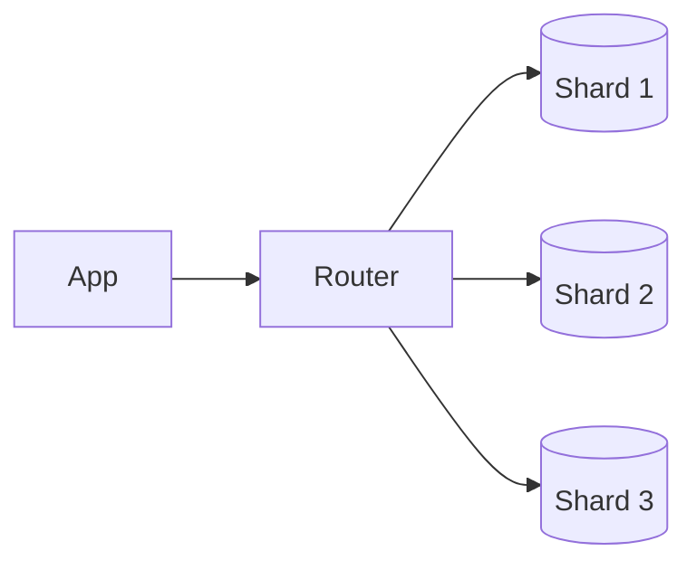
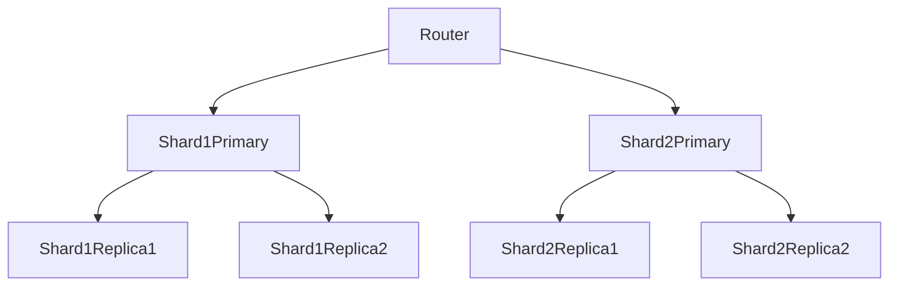

# Replication vs Sharding

Replication and sharding are two different database scaling techniques.

* Replication improves read scalability and availability.
* Sharding improves write scalability and storage capacity.

---

# Replication

Replication creates copies of the same database across multiple servers.



---

## Goals of Replication

* Increase read throughput
* Improve availability
* Enable failover
* Reduce primary DB load

---

## How It Works

* Writes go to primary database
* Replicas asynchronously/synchronously copy data
* Reads may be distributed across replicas

---

## Advantages

* Better read scalability
* High availability
* Disaster recovery support
* Easier backups

---

## Problems

### Replication Lag

Replicas may not immediately reflect latest writes.

Example:

```txt id="5j1e7j"
User updates profile
Primary updated
Replica still has old value
```

Causes stale reads.

---

## Failover Complexity

If primary crashes:

* replica promoted to primary

Challenges:

* data loss
* split brain
* delayed recovery

---

# Sharding

Sharding splits data across multiple databases.

Each shard stores only part of dataset.



---

## Goals of Sharding

* Scale writes
* Scale storage
* Distribute traffic
* Prevent single DB bottlenecks

---

# Common Sharding Strategies

| Strategy    | Example           | Problem            |
| ----------- | ----------------- | ------------------ |
| Range-based | User IDs 1–1M     | Hot shards         |
| Hash-based  | hash(user_id)     | Hard range queries |
| Geo-based   | Region-wise split | Cross-region joins |

---

# Sharding Challenges

## Hot Partitions

Some shards receive disproportionate traffic.

Example:

* celebrity users
* trending content

### Mitigation

* better shard keys
* consistent hashing
* dynamic rebalancing

---

## Cross-Shard Queries

Joins across shards become expensive.

Example:

```txt id="zwrj8k"
User data on shard 1
Order data on shard 3
```

Requires distributed queries.

---

## Rebalancing

Adding new shards requires moving data.

### Problems

* migration overhead
* temporary instability
* uneven redistribution

---

# Replication vs Sharding

| Feature          | Replication | Sharding             |
| ---------------- | ----------- | -------------------- |
| Purpose          | Scale reads | Scale writes/storage |
| Data             | Full copy   | Partial dataset      |
| Complexity       | Moderate    | High                 |
| Main Problem     | Replica lag | Hot partitions       |
| Availability     | High        | Depends on design    |
| Query Complexity | Lower       | Higher               |

---

# Combining Both

Large systems usually use both.



Each shard may itself have replicas.

---

# Important Tradeoffs

| Choice            | Advantage            | Disadvantage           |
| ----------------- | -------------------- | ---------------------- |
| Replication       | Better availability  | Stale reads            |
| Sharding          | Better write scaling | Operational complexity |
| Async replication | Lower latency        | Replica lag            |
| Sync replication  | Stronger consistency | Slower writes          |

---

# Failure Scenarios

| Failure         | Impact       | Mitigation                |
| --------------- | ------------ | ------------------------- |
| Primary crash   | Downtime     | Automatic failover        |
| Replica lag     | Stale reads  | Read routing              |
| Hot shard       | High latency | Rebalancing               |
| Uneven sharding | Poor scaling | Better partition strategy |

---

# Interview Discussion Points

* Choosing shard keys
* Handling replica lag
* Cross-shard joins
* Rebalancing strategies
* Multi-region replication
* Consistency tradeoffs
* Read-after-write consistency
* Hot partition mitigation
