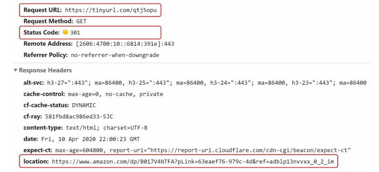
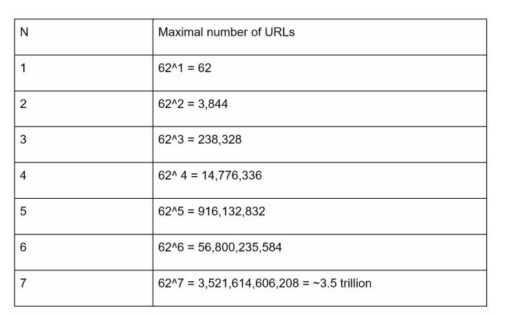
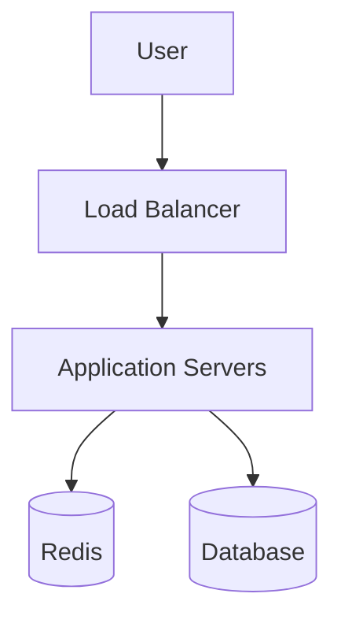
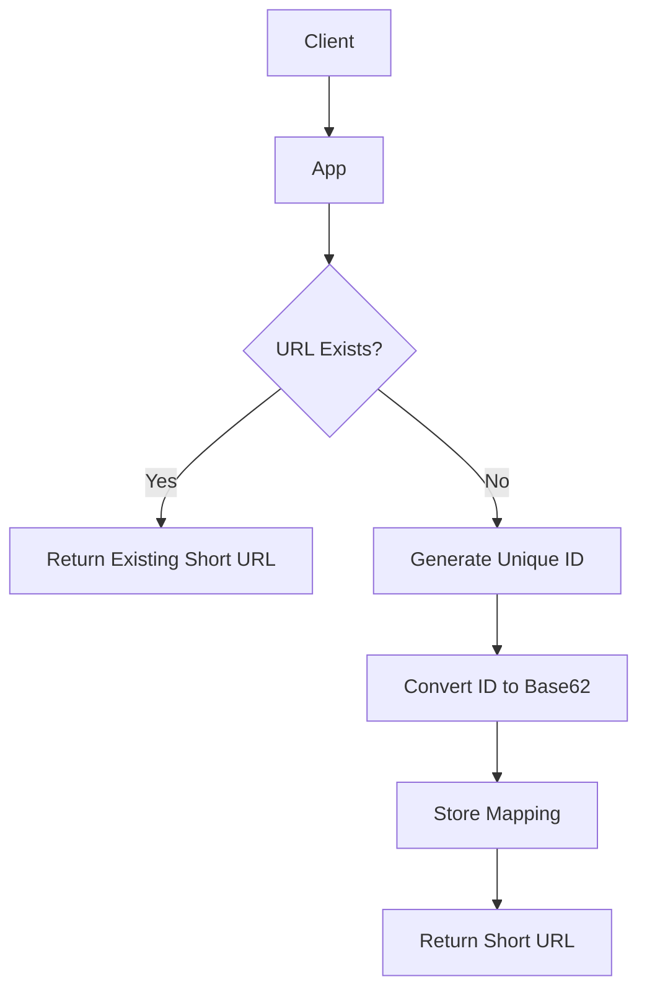
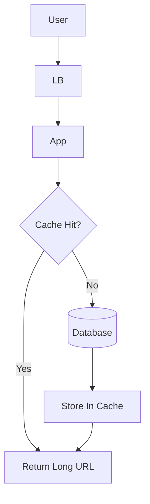

# Design a URL Shortener

A URL shortener converts long URLs into shorter aliases.

Example:

```txt
https://example.com/very/long/url
↓
https://tinyurl.com/zn9edcu
```



---

# Requirements

## Functional Requirements

* Generate short URLs
* Redirect short URLs to original URLs
* URLs should be unique
* Low redirection latency

---

## Non-Functional Requirements

* High availability
* Scalability
* Fault tolerance
* Fast redirects

---

# Back of the Envelope Estimation

Assume:

* 100M new URLs/day
* Read:Write ratio = 10:1

### Traffic

```txt
Writes/sec ≈ 1160
Reads/sec ≈ 11,600
```

### Storage

```txt
100M * 365 * 10
≈ 365B URLs over 10 years
```

If average URL length is 100 bytes:

```txt
≈ 36.5 TB raw storage
```

---

# High-Level Architecture



---

# APIs

## Create Short URL

```http
POST /api/v1/shorten
```

Request:

```json
{
  "longUrl": "https://example.com/page"
}
```

Response:

```json
{
  "shortUrl": "https://tinyurl.com/zn9edcu"
}
```

---

## Redirect URL

```http
GET /{shortUrl}
```

Returns:

* HTTP 301 or 302 redirect

---

# 301 vs 302 Redirect

| Redirect | Meaning            | Tradeoff                          |
| -------- | ------------------ | --------------------------------- |
| 301      | Permanent redirect | Better caching, lower server load |
| 302      | Temporary redirect | Better analytics tracking         |

Interview discussion point:

* 301 reduces backend traffic significantly because browsers cache redirects.

---

# Database Schema

```sql
CREATE TABLE urls (
    id BIGINT PRIMARY KEY,
    short_url VARCHAR(10) UNIQUE,
    long_url TEXT
);
```

---

# Why Base62?

Allowed characters:

```txt
[a-z][A-Z][0-9]
```

Total:

```txt
26 + 26 + 10 = 62 characters
```

Base62 helps generate:

* compact URLs
* URL-safe identifiers
* shorter representations of numeric IDs

---

# Base62 Conversion

Instead of hashing URLs directly:

1. Generate unique numeric ID
2. Convert ID to Base62

Example:

```txt
2009215674938
↓
zn9edcu
```

---

# URL Shortening Flow



---

# URL Redirect Flow



---

# Caching

Because reads are much higher than writes:

* cache heavily used URLs
* reduce DB load
* improve redirect latency

Redis is commonly used.

---

# Unique ID Generation

Need globally unique IDs across distributed systems.

Common choice:

* Snowflake IDs

Properties:

* sortable
* scalable
* distributed

---

# Scaling Considerations

| Problem           | Solution          |
| ----------------- | ----------------- |
| High read traffic | Redis caching     |
| DB bottleneck     | Read replicas     |
| Hot URLs          | Replication + CDN |
| Large dataset     | Sharding          |
| Traffic spikes    | Load balancing    |

---

# Common Bottlenecks

## Hot URLs

Popular links may receive massive traffic.

### Mitigation

* CDN caching
* Redis replication
* local in-memory cache

---

## Cache Failures

If Redis crashes:

* DB traffic spikes dramatically

### Mitigation

* replication
* fallback logic
* autoscaling

---

# Tradeoffs

| Choice             | Advantage           | Disadvantage                  |
| ------------------ | ------------------- | ----------------------------- |
| 301 Redirect       | Lower backend load  | Harder analytics              |
| 302 Redirect       | Better tracking     | More backend traffic          |
| Base62             | Short readable URLs | Requires unique ID generation |
| Cache-heavy design | Low latency         | Cache consistency complexity  |

---

# Interview Discussion Points

* Why Base62 is used
* 301 vs 302 redirects
* Cache strategy
* Hot URL handling
* Distributed ID generation
* Database sharding
* Read-heavy optimization
* CDN integration
